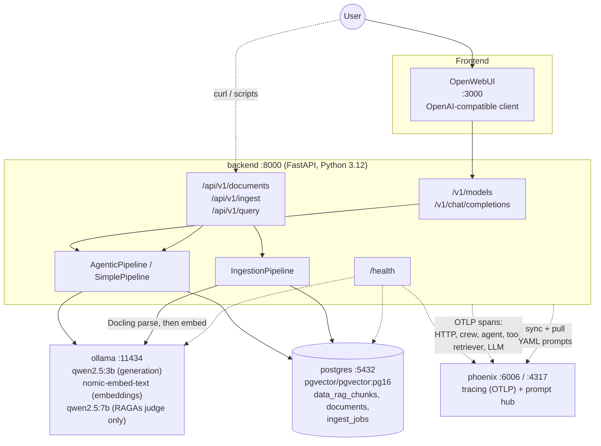
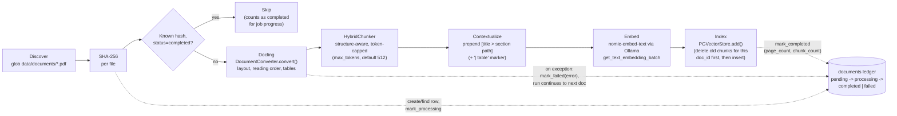
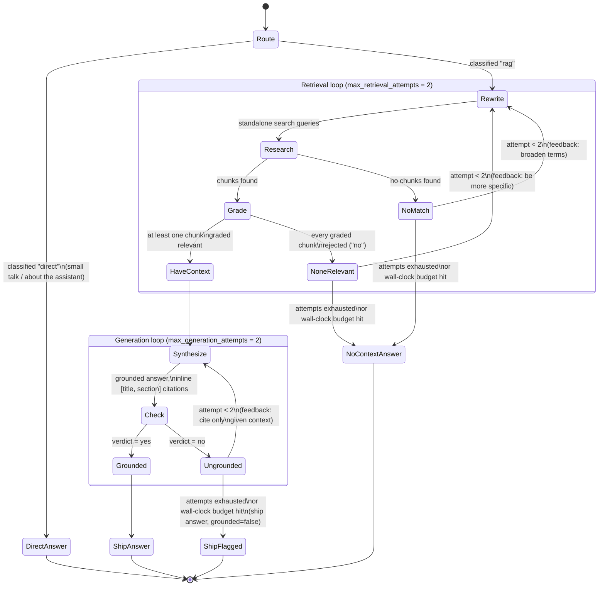
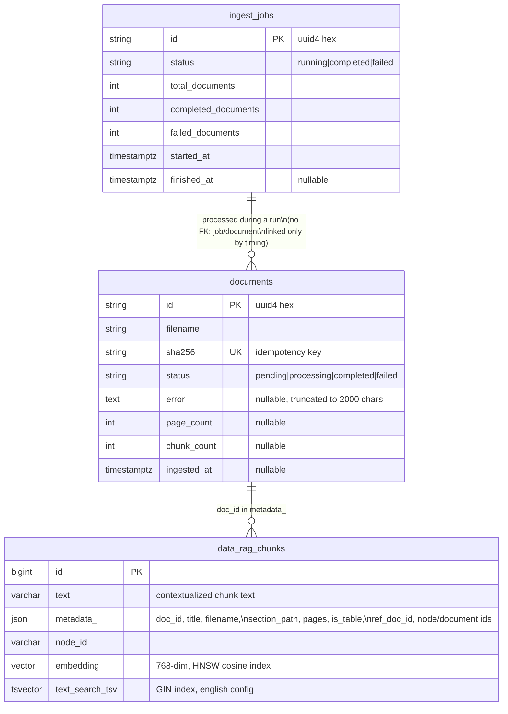

# DocuMind Architecture

This document describes what was actually built: HLD/LLD for the ingestion pipeline, the agentic RAG pipeline, and the Postgres data model. Every diagram below reflects the code under `backend/app/` as it exists on `feat/implementation`, not the original proposal; where the two differ, a note says so.

---

## 1. System context

`ollama-init` (not shown: it is a one-shot container, not a running service) pulls all three models on first boot and exits 0; every other service depends on `ollama` being healthy, not on `ollama-init` having finished, so the backend can start before models are ready and simply fail individual LLM calls until they are.

---

## 2. Ingestion flow

Triggered by `scripts/ingest.py`, `POST /api/v1/ingest` (background job, polled via `GET /api/v1/ingest/{job_id}`), or `POST /api/v1/documents` (single-file, synchronous). All three call into the same `app.ingestion.pipeline.IngestionPipeline`.

**Concurrency and safety notes actually implemented:**

- `DocumentConverter` (Docling) is not documented thread-safe, so a single process-wide converter is shared behind an `RLock`; conversion is fully serialized across concurrent ingestion jobs. Correctness over throughput, since ingestion is not the hot path.
- Re-ingesting an already-completed document with an unchanged hash is skipped entirely (idempotency); a changed file gets a fresh SHA-256, so it is treated as new and its old chunks are deleted (`store.delete(ref_doc_id=doc_id)`) before the new ones are inserted.
- Per-document failure isolation: `IngestionPipeline.run()` wraps each document in its own `try/except`; one corrupt PDF is recorded as `failed` with its error message and the job continues to the next document rather than aborting the whole batch.
- A skipped (already-ingested) document still counts toward the job's `completed_documents`, so a job's progress can reach 100% even on a run where every document was already up to date.
- **TorchDynamo is disabled** (`TORCHDYNAMO_DISABLE=1` in `backend/Dockerfile`). Docling's model path invokes `torch.compile`, which needs a C++ compiler the slim base image doesn't have; since this all runs CPU-only anyway, compilation buys no speedup, so it's turned off rather than adding a toolchain to the image.

---

## 3. Agentic pipeline (corrective RAG)

`app.pipelines.agentic.AgenticPipeline` owns this state machine; `app.agents.stages.CrewStages` owns turning each state into either a CrewAI crew kickoff (a single agent, single task, run to completion) or, for one stage, a direct LLM call, and parsing its output. Five CrewAI agent roles: Router, Query Rewriter, Researcher, Answer Synthesizer, Groundedness Checker. The sixth stage, Relevance Grading, is *not* a CrewAI agent: `CrewStages.grade()` calls `self.llm.call(...)` directly, with no `Agent`, `Task`, or `Crew` involved, because wrapping the per-chunk yes/no verdict in a CrewAI `Agent` was measured to invert the model's judgment: the agent wrapper injects its own system message, and that system message alone flipped the small model to answering "no" regardless of content, confirmed with a control question that has an obvious answer ("Is grass green?", answered "no" with the system message present and "yes" with it removed). Removing the wrapper for this one stage and calling the model directly restored genuine per-chunk discrimination.

**The three independent bounds** (from `AgenticPipeline`'s module docstring, all load-bearing, none of them redundant with the others):

1. **Attempt bounds.** `max_retrieval_attempts` and `max_generation_attempts` (both default 2): one attempt plus at most one correction, each. This bounds *how many times* a loop can run, not how long it takes.
2. **Wall-clock request budget** (`request_budget_seconds`, default 300s). `llm_timeout_seconds` only bounds a single completion; one request can make roughly a dozen of them in the worst case (router, rewrite/retrieve retry, up to `retrieval_top_k` per-chunk grader calls, synthesis/verification retry), so a degraded Ollama could otherwise hold a worker for a very long time. Checked at stage boundaries only: it stops the pipeline from *starting more work* and returns the best result already in hand. It deliberately never skips the first attempt of either loop (a response that tried nothing is worse than a slow one), and it cannot interrupt a completion already in flight, that is `llm_timeout_seconds`'s job.
3. **Exception containment.** Any unexpected stage failure returns a friendly `PipelineResult` (`grounded=None`) instead of propagating as a bare 500. The one deliberate exception: `LLM_UNAVAILABLE_ERRORS` (an unreachable or timed-out Ollama) is re-raised so `app.api.query` and the OpenAI-compatible endpoint can turn it into a structured `503`, since upstream unavailability is an expected condition with its own designed response, not an unexpected bug. The groundedness checker additionally fails open on its own crash (treated as grounded) so a flaky verifier can never discard an answer already produced.

**Relevance grading is one binary yes/no call per chunk**, not a single call returning a JSON array of relevant indices, and this was a mid-implementation correction, not the original plan: an earlier version asked the grader for a single JSON array of relevant chunk indices across all chunks at once, but the deployed 3B model returned an empty array for every input, relevant or not, once CrewAI's own task boilerplate was appended, which made the pipeline refuse to answer even when the corpus had the answer. It is bounded to the top `retrieval_top_k` chunks by score, so a broad retrieval cannot turn into an unbounded number of grading calls. Every parser in `app.agents.stages` (route, chunk indices, queries, groundedness verdict) fails toward *keeping more*, not less, on an unreadable model reply: an off-format grader keeps the chunk, an off-format router retrieves, an off-format hallucination check assumes grounded. Only an explicit, well-formed rejection (`no`, or an explicit empty array) is trusted as a real negative judgment.

**Simple mode** (`DOCUMIND_PIPELINE_MODE=simple`) is a separate, much shorter pipeline (`app.pipelines.simple.SimplePipeline`): retrieve once, synthesize once, no grading, no rewriting, no correction loop. It is both the low-latency escape hatch and the RAGAs "naive RAG" baseline the agentic pipeline is compared against.

---

## 4. Data model (Postgres)

Three tables, all created by `Base.metadata.create_all()` at startup (no separate migration tool; acceptable for this project's scope). Schema below is read directly from the running database, not from the ORM definitions, so it reflects exactly what LlamaIndex's `PGVectorStore` actually created for the chunk table.

Indexes actually present on `data_rag_chunks` (confirmed against the live instance):

- `data_rag_chunks_pkey`: btree, primary key on `id`.
- `data_rag_chunks_embedding_idx`: HNSW on `embedding`, `vector_cosine_ops`, `m=16`, `ef_construction=64` (search-time `ef_search=40`, set by the app at query time).
- `rag_chunks_idx`: GIN on `text_search_tsv`, this is what makes the lexical half of hybrid search fast.
- `rag_chunks_idx_1`: btree on `metadata_ ->> 'ref_doc_id'`, used by `store.delete(ref_doc_id=...)` during re-ingestion.

`data_rag_chunks` is LlamaIndex's own table, named by prefixing `Settings.vector_table_name` (`rag_chunks`) with `data_`; the app's own code only ever refers to it as `rag_chunks` via config, never hardcodes the `data_` prefix. `documents` and `ingest_jobs` are hand-rolled SQLAlchemy models (`app/db/models.py`) that exist purely as an ingestion ledger; there is no foreign key between `ingest_jobs` and `documents` because a job's identity is a batch run, not an owner of specific document rows (a document can be created or updated by more than one job over its lifetime, e.g. re-ingestion).

---

## 5. Key design properties

- **Idempotency.** Ingestion keys on SHA-256 of file bytes; an unchanged file is skipped, a changed one gets a fresh hash, is treated as new, and has its old chunks deleted before new ones are added. Running `POST /api/v1/ingest` twice in a row against an unchanged `data/documents/` is a safe no-op.
- **Per-document failure isolation.** One Docling failure marks that document `failed` with its error text and the batch continues; it does not abort the run or affect any other document's status.
- **Bounded corrective loops.** Both correction loops in the agentic pipeline have a hard attempt cap (default 2 each: one try, one correction), independent of a separate wall-clock budget (default 300s) that stops the pipeline from starting new work once exhausted, regardless of how many attempts remain.
- **Prompt versioning.** Every prompt is YAML, git-versioned, with an explicit `version:` field; Phoenix's prompt hub is a synced, editable mirror (content-hash deduped so repeated syncs don't create redundant versions), not the source of truth, so the system degrades gracefully to YAML if Phoenix is unreachable.
- **Trace propagation.** A `correlation.id` generated (or forwarded from `X-Correlation-ID`) per HTTP request is attached to the active OpenTelemetry span and echoed in logs and the response header; FastAPI/ASGI instrumentation is applied per-app-instance (not gated behind a process-wide flag) specifically so every `create_app()` call, including in tests, gets a real root span rather than a silent no-op one.
