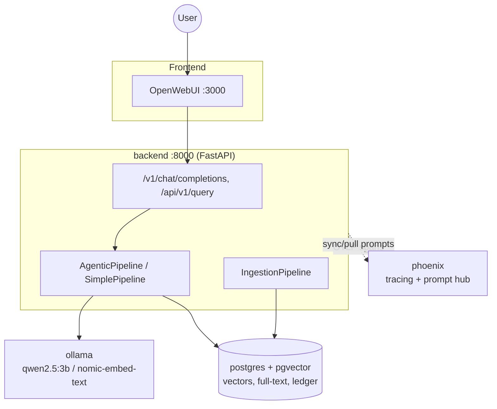

# DocuMind

A document search platform with an agentic, self-correcting RAG backend.

Drop PDFs in, ask questions in a normal chat UI or over REST, get cited answers.

*Technical assessment submission*

---

## The brief

**Goal:** a document search platform that answers questions about ingested PDFs, with citations, through a chat frontend and a plain REST API.

**Mandated stack (all required, not optional):**

- Docling: PDF parsing
- PGVector: vector store
- LlamaIndex: retrieval orchestration
- CrewAI: agentic pipeline
- Ollama: local inference
- Arize Phoenix: tracing + prompt management
- RAGAs: evaluation
- OpenWebUI: chat frontend

**Constraints:** CPU-only, one-command startup (`docker compose up -d --build`).

---

## Architecture



One FastAPI service, one Postgres instance (vectors + full-text + ledger), one Ollama, one Phoenix. No microservices: the scope doesn't need them.

---

## Mandated-stack mapping

| Tool | Where it lives |
|---|---|
| Docling | `backend/app/ingestion/pipeline.py`, `preprocessor.py`: `DocumentConverter`, `HybridChunker` |
| PGVector | `postgres` service (`pgvector/pgvector:pg16`); `backend/app/retrieval/vector_store.py` |
| LlamaIndex | `backend/app/retrieval/retriever.py`, `vector_store.py`: hybrid retriever |
| CrewAI | `backend/app/agents/stages.py`, `tools.py`, `llm.py`: five CrewAI agent roles plus one direct-call grading stage |
| Ollama | `ollama` service in `docker-compose.yml`; `qwen2.5:3b`, `nomic-embed-text`, `qwen2.5:7b` |
| Phoenix | `backend/app/observability/tracing.py`, `prompts.py`; `phoenix` service |
| RAGAs | `scripts/evaluate.py`, `evaluation/golden_set.json` |
| OpenWebUI | `openwebui` service; `backend/app/api/openai_compat.py` |

Every required tool has one clear owning module. Nothing mandated is stubbed or mocked in production code.

---

## Ingestion pipeline

```
Discover PDFs → SHA-256 → Docling parse → HybridChunker
    → contextualize (prepend header) → embed (nomic-embed-text)
    → index (PGVector, hybrid)
```

- **Idempotent.** Unchanged file (same hash) is skipped; a changed file is re-chunked and its old rows replaced.
- **Per-document failure isolation.** One bad PDF is marked `failed` with its error; the batch continues.
- **Result on the real corpus:** 6 documents ingested, 41 chunks total.

| Document | Chunks |
|---|---|
| Form No. 42: ARN | 3 |
| Form No. 42: Filed | 4 |
| French timesheet | 1 |
| Invoice, June '26 | 3 |
| Invoice, June 26 | 3 |
| Payslip, Jun 2026 | 27 |

---

## Contextual chunking: before / after

Each chunk is a plain Docling text span. Out of context, it's meaningless:

> "Three attachments are listed in the table."

At ingest time, `app/ingestion/contextualizer.py` prepends a structural header built from Docling's own heading hierarchy, with no LLM call:

> **`[Form No. 42: Filed Form > Attachment Table]`**
> "Three attachments are listed in the table."

- Header = document title + section path (+ a `| table` marker for table chunks).
- Baked into the embedded text and the stored chunk, so **retrieval and citation get it for free**: zero query-time cost, zero extra ingest-time LLM cost, fully deterministic.
- Trade-off: structural context, not a free-form LLM summary, but enough for citations on forms/invoices/payslips with a real heading hierarchy.

---

## The agentic corrective-RAG crew

Five CrewAI agent roles, one crew (single agent, single task) per stage, orchestrated by plain Python control flow, not CrewAI's own delegation, plus one stage that bypasses CrewAI entirely:

| Stage | Kind |
|---|---|
| Router | CrewAI agent, LLM call |
| Query Rewriter | CrewAI agent, LLM call |
| Researcher | CrewAI agent, **tool execution** (`document_search` → LlamaIndex hybrid retriever) |
| Relevance Grader | **direct LLM call, no CrewAI agent** -- one binary call per chunk (wrapping this in a CrewAI `Agent` was measured to invert the model's judgment) |
| Answer Synthesizer | CrewAI agent, LLM call |
| Groundedness Checker | CrewAI agent, LLM call |

**Two independently bounded correction loops:**
- Retrieval loop (`max_retrieval_attempts = 2`): no/irrelevant chunks → rewrite once, retry.
- Generation loop (`max_generation_attempts = 2`): ungrounded answer → regenerate once with feedback.

Plus a wall-clock request budget (300s) checked at stage boundaries, independent of both attempt caps.

**Measured against the real, fully populated corpus (25 golden-set questions, `doc/evaluation-report.md`):** latency ranges from 60s (min) to 258s (max), median 125s, mean 132s. An earlier per-stage timing figure (router 2.6s, rewriter 3.2s, researcher+tool 12.9s, synthesizer 5.0s, checker 2.7s, totaling ~28.6s crew / ~37s over HTTP) was measured against an empty index before the corpus was ingested and does not reflect real usage; it is superseded by the numbers above.

---

## OpenWebUI integration & streaming UX

- Backend exposes `GET /v1/models` and `POST /v1/chat/completions`, matching the OpenAI schema exactly.
- OpenWebUI is a stock OpenAI-compatible connection: **zero custom OpenWebUI plugin code.**
- OpenAI's schema has no "agent is thinking" field. A CPU agentic answer takes 30-60s; silence reads as broken.
- Fix: with `stream: true`, the response opens a `<think>...</think>` block and streams one line per stage boundary (*"Routing query…", "Searching documents…", "Grading context…"*), closes it, then streams the real answer.

*(Screenshot not included in this submission: OpenWebUI chat with the think-block expanded and a cited answer visible. Optional -- see `doc/presentation/README.md` for exactly what to capture and where to drop it, `img/chat.png`, if you want to add one.)*

---

## Observability: the Phoenix trace tree

Every request produces one trace:

```
CHAIN  crew kickoff (per stage)
  AGENT  role (Router / Rewriter / Researcher / Synthesizer / Checker)
    TOOL   document_search
      LlamaIndex retriever / embedding spans
    LLM    ChatCompletion (prompt, completion, model, token counts)
```

The Relevance Grader is a direct LLM call, not a CrewAI agent, so it produces an `LLM` span but no `AGENT` span -- there is no "Grader" agent span in any trace.

- One real agentic HTTP query produced **7 LLM spans**, **~1847 prompt + 240 completion tokens**.
- A `correlation.id` on every span ties it back to the request's log lines (`X-Correlation-ID`).

*(Screenshot not included in this submission: Phoenix trace tree for one agentic query. Optional -- see `doc/presentation/README.md` for exactly what to capture and where to drop it, `img/trace.png`, if you want to add one.)*

---

## PromptOps

```
prompts/*.yaml (git-versioned, source of truth)
        │  startup: sync (content-hash deduped)
        ▼
Phoenix prompt hub
        │  startup: pull current version back
        ▼
Runtime prompt used by the crew
```

- Every agent prompt is externalized YAML, never hardcoded.
- Sync compares content first, so repeated restarts don't pile up duplicate versions.
- A prompt edited in the **Phoenix UI wins for the rest of that process**, no restart, no redeploy.
- Phoenix unreachable → falls back to YAML silently; nothing breaks.
- Permanent change still has to land in git: edit the `.yaml`, bump `version:`, commit.

---

## Evaluation

**Methodology:** `scripts/evaluate.py` runs the golden set through both pipeline modes via `/api/v1/query`, scores each response with **RAGAs** (faithfulness, answer relevancy, context precision, context recall), judged by a local `qwen2.5:7b` (fully offline, no cloud judge).

**Golden set (25 hand-curated questions):**

| Category | Count |
|---|---|
| Single-doc factual | 15 |
| Single-doc numeric | 6 |
| Multi-doc | 2 |
| Unanswerable | 2 |

**Comparison design:** agentic (corrective crew) vs. simple (retrieve-once, naive baseline), same judge for both, so judge bias mostly cancels out of the *relative* comparison even though absolute scores stay noisy.

**Headline result (full 25-question sweep against the real corpus, `doc/evaluation-report.md`):**

- Agentic mode answered 15 of 23 answerable questions and correctly refused both of the 2 unanswerable ones, with **zero fabricated answers** across all 25.
- The 8 refusals on answerable questions were all traced to the per-chunk relevance grader rejecting every retrieved chunk before synthesis ran, not to a retrieval failure (confirmed by re-running 4 of them in simple mode, which answered all 4 correctly from the same index).
- Latency: min 60s, median 125s, mean 132s, max 258s over the 25 questions.
- A fail-open grader fix (proceed to synthesis on the top-ranked chunks when the grader rejected all of them) was tried, found to fix those 8 refusals but fabricate an answer on an unanswerable question, and reverted.

---

## Engineering findings

The most interesting failures this build actually surfaced:

- **A 3B model returning `[]` for every grader call, and a second, deeper bug hiding behind the first fix.** A single call asking for a JSON array of relevant chunk indices got an empty array back for every input (relevant, irrelevant, or none) once CrewAI's own `expected_output` boilerplate was appended. Rewording to one yes/no verdict per chunk looked like the fix in an initial live check, but that check ran the question as a bare completion, not through the actual code path; once the real `CrewStages.grade()` used the same CrewAI `Agent`/`Task` wrapper as every other stage, it answered "no" for essentially everything regardless of chunk content. Isolating variables live showed the CrewAI agent's own system message, not the wording, flipped the model negative (confirmed with a control question, "Is grass green?"). The real fix removes the CrewAI wrapper for this one stage entirely: a direct `self.llm.call(...)` completion, verified live to discriminate correctly on real chunks.
- **CrewAI's module-level `load_dotenv()`.** Simply `import crewai` loaded the repo's `.env` into `os.environ` and silently overrode `get_settings()` process-wide, breaking auth tests.
- **A pydantic v2 field rebuild broke a shared buffer.** Pydantic v2 rebuilds list-typed fields, so the agent tool's result buffer became a *different* list object: every tool result was discarded and retrieval silently ran twice per call.
- **Docling needed TorchDynamo disabled.** The slim base image has no C++ toolchain; Docling's model path invokes `torch.compile`, which failed every ingestion until `TORCHDYNAMO_DISABLE=1` was set (compilation buys nothing on CPU-only anyway).

---

## Trade-offs & limitations

- **CPU-only latency.** Measured against the real corpus over 25 questions: simple mode 25 to 82s, agentic mode 60 to 258s (median 125s, mean 132s). This is the assessment's own constraint, not a config miss: the user explicitly chose agentic depth over speed.
- **The judge is a small local model, not a frontier one.** `qwen2.5:7b` on CPU makes RAGAs scores directionally useful, not precise. Same judge scores both pipelines, so the comparison is more trustworthy than any single absolute score.
- **The per-chunk grader is measurably over-selective.** Across the full 25-question sweep against the real corpus, the grader rejected every retrieved chunk on 8 of 23 answerable questions, driving agentic mode's recall well below simple mode's (`doc/evaluation-report.md`). A fail-open fallback around the grader was tried and fixed those refusals, but it also caused a fabricated answer on a genuinely unanswerable question, so it was reverted; the grader's recall gap remains open, with a larger judge model (`qwen2.5:7b`) identified as the next thing to try.

---

## Future work

- **GPU inference**: same pipeline, drop-in `DOCUMIND_OLLAMA_BASE_URL` pointed at a GPU host; latency drops accordingly, no design change needed.
- **Reranking**: a cross-encoder pass after hybrid retrieval, ahead of the grader.
- **Semantic caching**: cache answers for near-duplicate questions to cut repeated CPU inference cost.
- **Multi-tenancy**: namespace the vector store and ledger per tenant; currently single-corpus by design.
